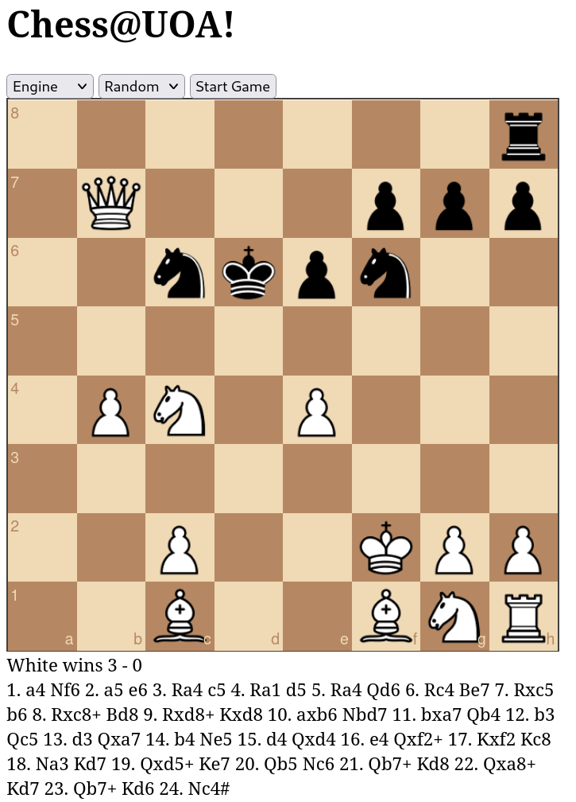

[](https://classroom.github.com/a/KoToqcBN)
# Build Your Own Chess Engine Template

Place all C code under `src` and compile your binary through:

```sh
make engine
```

## Wanna see it run on a browser?

First compile it to webassembly - requires the emscripten compiler (`apt install emscripten` if you don't have it) and then run:

```sh
make WEB_TARGET=web/engine.wasm web/engine.wasm
```

Finally, run the website (assumes you have python3 installed):

```sh
$ make run
python3 -m http.server --directory web
Serving HTTP on 0.0.0.0 port 8000 (http://0.0.0.0:8000/) ...
```

You should now be able to interact with your engine on http://0.0.0.0:8000/.

